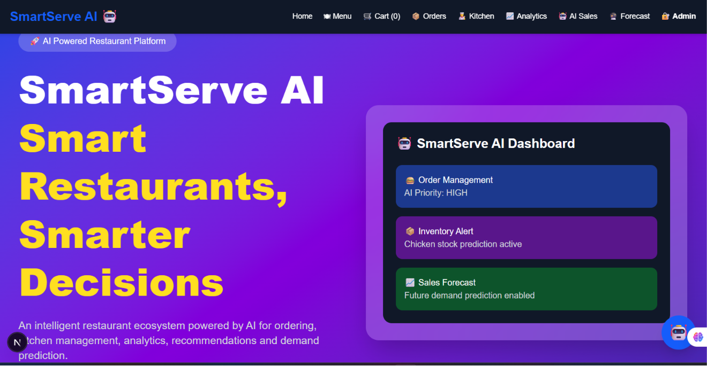
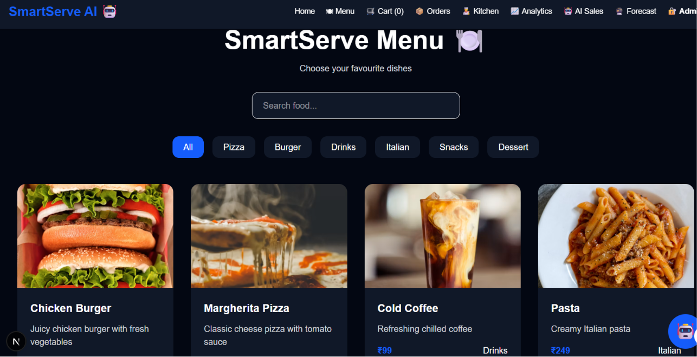
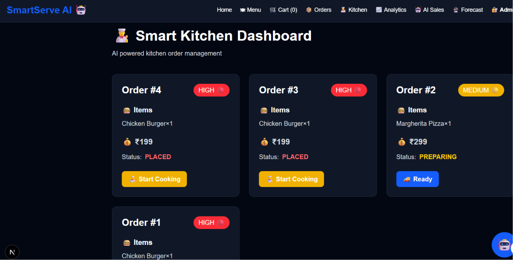
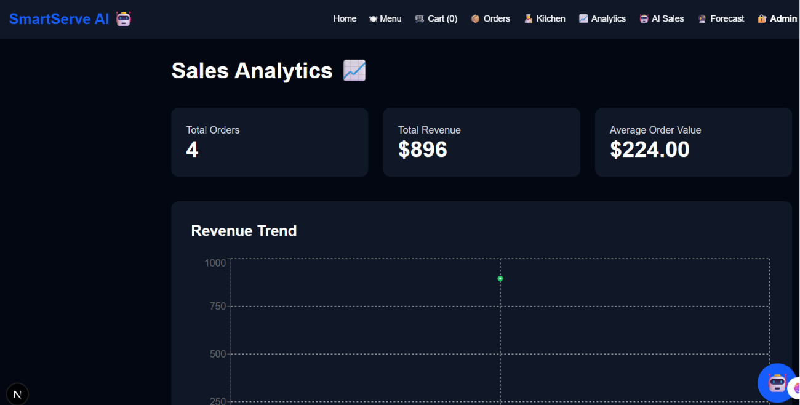
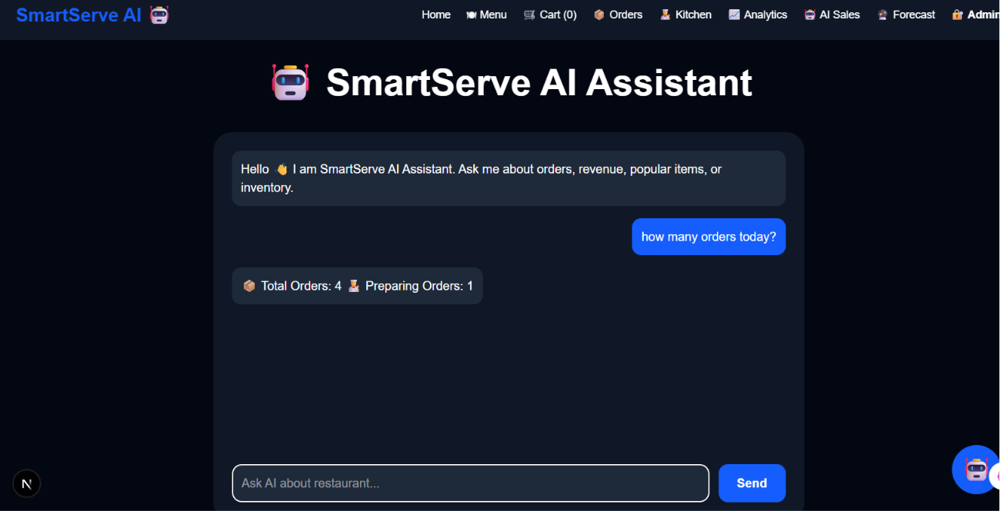

# 🍽️ SmartServe AI 🤖

## AI-Powered Restaurant Intelligence Platform

SmartServe AI is a next-generation restaurant management platform that combines **Artificial Intelligence, automation, analytics, and modern full-stack technologies** to transform traditional restaurant operations.

The platform provides smart food ordering, kitchen automation, inventory management, analytics dashboards, and AI-powered insights to help restaurants make faster and smarter decisions.

> 🚀 Building an intelligent operating system for modern restaurants.

---

# 🌟 Problem Statement

Traditional restaurant systems face challenges such as:

- Manual order handling
- Inefficient kitchen workflows
- Food wastage due to poor inventory planning
- Lack of customer personalization
- Limited business insights

SmartServe AI solves these challenges by introducing:

✅ Smart ordering  
✅ Kitchen automation  
✅ Inventory intelligence  
✅ AI recommendations  
✅ Predictive analytics  
✅ Real-time dashboards  

---

# 🚀 Key Features

## 👤 Smart Customer Ordering

Customers can:

- Browse digital menu
- View food categories
- Add items to cart
- Manage quantities
- Place orders
- Track order progress

---

# 👨‍🍳 Kitchen Automation Dashboard

SmartServe AI helps kitchen teams manage operations efficiently.

Features:

- View incoming orders
- Track order status
- Update preparation progress
- Improve kitchen workflow
- Reduce order processing time

---

# 📦 Smart Inventory Management

The inventory module helps restaurants monitor stock efficiently.

Features:

- Inventory tracking
- Stock management
- Database-powered inventory system
- Future AI-based stock prediction

---

# 📊 Analytics Dashboard

The analytics dashboard provides restaurant insights.

Features:

- Restaurant activity monitoring
- Order analysis
- Performance visualization
- Data-driven decision support

---

# 🤖 AI Intelligence Layer

SmartServe AI is designed with AI-first architecture.

## 🍔 AI Food Recommendation System

Future capability:

- Analyze customer preferences
- Suggest personalized dishes
- Improve customer experience

Example:

```
Customer Preference:

Vegetarian + Spicy

AI Recommendation:

🔥 Paneer Tikka
🌶️ Schezwan Noodles
🍛 Veg Biryani
```

---

## 📈 Sales Prediction

AI-powered forecasting helps restaurants understand future demand.

Example:

```
Tomorrow Forecast:

🍔 Burgers      ↑ 35%
🍕 Pizza        ↑ 22%
🥤 Drinks       ↑ 18%

Recommendation:

Increase burger ingredient stock.
```

---

## 🔮 Demand Forecasting

SmartServe AI aims to predict:

- Popular food items
- Peak ordering hours
- Future customer demand
- Inventory requirements

---

# 🏗️ System Architecture

```
                         👤 Customers
                              |
                              |
                              ▼

                  🌐 Next.js Frontend
             React + TypeScript + Tailwind CSS

                              |
                              |
        ------------------------------------------------
        |                    |                         |
        ▼                    ▼                         ▼

   Menu System        Order Management        Dashboard


                              |
                              ▼

                    Backend API Layer


                              |
                              ▼

                 Prisma ORM + PostgreSQL


                              |
                              ▼

                    🤖 AI Intelligence Layer

        Recommendations | Forecasting | Analytics
```

---

# 🛠️ Technology Stack

## Frontend

- Next.js
- React
- TypeScript
- Tailwind CSS

## Backend

- Next.js API Routes
- REST API Architecture

## Database

- PostgreSQL
- Prisma ORM

## AI & Analytics

- Machine Learning Models
- Recommendation Systems
- Predictive Analytics
- Data-driven Insights

## Development Tools

- Git
- GitHub
- VS Code
- npm

---

# 📂 Project Structure

```
SmartServe-AI/

│
├── app/
│   ├── dashboard/
│   ├── menu/
│   ├── kitchen/
│   ├── api/
│   ├── layout.tsx
│   ├── page.tsx
│   └── globals.css
│
├── components/
│   ├── Navbar.tsx
│   ├── CartContext.tsx
│   └── UI Components
│
├── prisma/
│   ├── schema.prisma
│   ├── seed.ts
│   └── migrations/
│
├── public/
│   ├── images/
│   │   ├── Burger.png
│   │   ├── Pizza.png
│   │   ├── Pasta.png
│   │   ├── French fries.png
│   │   ├── Cold coffee.png
│   │   └── Chocolate cake.png
│   │
│   └── screenshots/
│       ├── home.png
│       ├── menu.png
│       ├── kitchen.png
│       ├── admin.png
│       ├── analytics.png
│       └── assistant.png
│
├── package.json
├── package-lock.json
├── next.config.ts
├── eslint.config.mjs
├── tailwind.config.js
├── .gitignore
├── AGENTS.md
├── CLAUDE.md
└── README.md
```

---

# ⚙️ Installation & Setup

## Clone Repository

```bash
git clone https://github.com/GandeRani/SmartServe-AI.git
```

Navigate to project:

```bash
cd SmartServe-AI
```

---

## Install Dependencies

```bash
npm install
```

---

## Setup Environment Variables

Create a `.env` file:

```env
DATABASE_URL="your_postgresql_database_url"
```

---

## Setup Prisma Database

Generate Prisma Client:

```bash
npx prisma generate
```

Run migrations:

```bash
npx prisma migrate dev
```

Seed database:

```bash
npx prisma db seed
```

---

## Run Application

Start development server:

```bash
npm run dev
```

Open:

```
http://localhost:3000
```

---

# 📸 Application Screenshots

## 🏠 Home Page

Restaurant landing experience.



---

## 🍔 Menu

Digital food ordering interface.



---

## 👨‍🍳 Kitchen Dashboard

Order management system.



---

## 📊 Analytics Dashboard

Business insights and analytics.



---

## 🤖 AI Assistant

AI-powered restaurant assistance.



---

# 📌 Current Project Status

| Module | Status |
|---|---|
| Next.js Application | ✅ Completed |
| Responsive UI | ✅ Completed |
| Home Page | ✅ Completed |
| Menu System | ✅ Completed |
| Cart System | ✅ Completed |
| Order Tracking | ✅ Completed |
| Kitchen Dashboard | ✅ Completed |
| Admin Dashboard | ✅ Completed |
| PostgreSQL Database | ✅ Completed |
| Prisma ORM | ✅ Completed |
| Inventory Module | ✅ Completed |
| Analytics Dashboard | ✅ Completed |
| AI Assistant | ✅ Completed |
| AI Recommendation Engine | 🔜 Enhancing |
| Sales Prediction | 🔜 Enhancing |
| Demand Forecasting | 🔜 Enhancing |

---

# 🏆 Hackathon Innovation

SmartServe AI combines:

### Artificial Intelligence

- Smart recommendations
- Predictive analytics
- Intelligent insights

### Automation

- Kitchen workflow automation
- Order management
- Inventory tracking

### Modern Software Engineering

- Full-stack architecture
- Database integration
- Scalable design

---

# 🎯 Impact

## For Customers

✅ Faster ordering  
✅ Better recommendations  
✅ Improved experience  

## For Restaurant Staff

✅ Reduced manual work  
✅ Faster kitchen operations  
✅ Better order tracking  

## For Restaurant Owners

✅ Data-driven decisions  
✅ Reduced food waste  
✅ Improved efficiency  

---


# 🌐 Repository

GitHub:

https://github.com/GandeRani/SmartServe-AI

---

# 👨‍💻 Author

## Gande Rani

AI & Software Engineering Enthusiast

GitHub:

https://github.com/GandeRani

---
